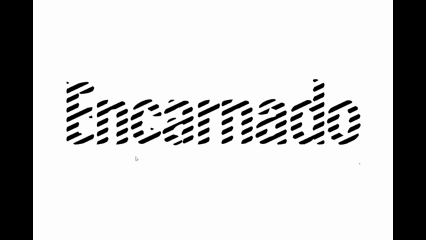
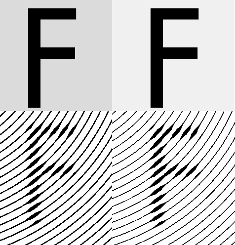

# halftones-processing
Interactive shader-powered halftones (shape, rings, lines) in Processing (Work-In-Progress)

Desenvolvido para processar a arte criada por Silvana Leal, gerando a capa do Songbook Ficções Populares e também os títulos das partituras. 

São aplicados dois shaders de _blur_ linear (um horizontal e o outro vertical) e depois o shader de halftone (nas opções shape, linha e círculos). Um blur gaussiano deixava as linhas com um aspecto muito arredondado, enquanto o blur linear dá um aspecto mais hexagonal - mais elegante na minha opinião.

Na imagem abaixo, perceba que quanto mais escuro o fundo, mais fortes as linhas do padrão (neste exemplo, círculos) aparecerão. Na imagem acima, o fundo era branco, por isso não vemos as linhas do padrão por toda a imagem.

Controles:
* [0, 1, 2] : MODO. Shape, Line, Rings (círculos)
* [Mouse] : Direção das linhas ou centro dos círculos
* [-] : Decrementa a FASE das linhas (na verdade é um seno) do modo Line
* [+] : Incrementa a FASE das linhas do modo Line
* [flecha UP] : Incrementa DENSIDADE das linhas (modos Line e Rings) 
* [flecha DOWN] : Decrementa DENSIDADE das linhas (modos Line e Rings)
* [flecha RIGHT] : Incrementa tamanho da suavização (blur)
* [flecha LEFT] : Decrementa tamanho da suavização (blur)
